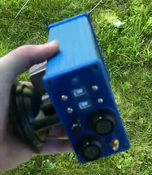

If you follow this documentation you will end up with a box like this:
TODO: Update pictures

 

## AutoSteer box content

| Part                                 | Types                                        | Comments                                                                                  |
|--------------------------------------|----------------------------------------------|-------------------------------------------------------------------------------------------|
| 3D printed holder For F9P            |                                              | Link? Alternative ?                                                                       |
| Micro controller                     | Arduino nano v3                              |                                                                                           |
| IMU                                  | CMPS14, BNO08x                               | Mind the 3,3v vs 5v?? CMPS14 is external?                                                 |
| H-Bridge to drive motor or valve     | Cytron MD13S                                 | Modded?                                                                                   |
| 5v relais for valve                  |                                              | One which can be mounted on the MD30S                                                     |
| Steer switch                         |                                              |                                                                                           |
| Implement switch?                    |                                              |                                                                                           |
| PCB                                  | KaupoiMOD v4.1                               | Needs mod? Also use Original PCBv2?                                                       |
| 12-24v step up converter             |                                              | only for 24v motor                                                                        |
| 12P Circulair connector              | Weipu SP2112/S 12                            | Mating connector  SP2110/P 12                                                             |
| 5P Circulair power connector         | Weipu SP2110/P 5                             | Mating connector  SP2110/P 5                                                              |
| Power switch                         | PartNumber??                                 |                                                                                           |
| 2x USB Connector                     | PartNumber??                                 | adafruit 936 or 937? Put USB Hub in the box and use one USB Cable                         |
| Sma extension cord                   | PartNumber??                                 |                                                                                           |
| External led                         | PartNumber??                                 |                                                                                           |
| Aluminum box 100x150                 | Hammond 1455N1602                            |                                                                                           |
| Suction cup like Benoits  for mount? | PartNumber??                                 | Maybe I like flaps with holes                                                             |

## Power connector pinout 
### Weipu SP2112/S 5 (30A) mating connector SP2110/P 5
| Pin | Connection |
|-----|------------|
| 01  | GND In     |
| 02  | 12V In     |
| 03  | +24V / +12V / PWM Left  / Danfoss Us  | 
| 04  | -24V / -12V / PWM Right |
| 05  | Shutoff valve on/off or Danfoss Udc |

## Aux connector pinout
### Weipu SP2112/S 12 (5A) (mating connector SP2110/P 12)

| Pin | Connection |
|-----|------------|
| 01  | WAS +5V    |
| 02  | WAS HIGH   |
| 03  | WAS GND/LOW|
| 04  | +12V       |
| 05  | GND        |
| 06  | STEER      |
| 07  | STEER GND  |
| 08  | IMP        |
| 09  | IMP GND    |
| 10  | REMOTE     |
| 11  | REMOTE GND |
| 12  | Arduino A0 |