We use the Kaupoi 4.1 PCB for the diagrams, but it can be used for any current PCB, you just have to look at the names of the connections on the PCB. The only difference is that the Kaupoi 4.1 has a slot for the Adafruit BNO085 and a slot for the CMPS14.

Later you will find diagrams to connect any BNO08x that is not from Adafruit. The difference between the BNOs is that Adafruit uses a voltage regulator, and you can supply it from 3V to 5V, and the other BNOs need 3V.  

Although the best way to connect the IMU (BNO or CMPS) to the system is 
through an IMU module, because the IMU data goes directly to AGIO and the 
PCB does not have to process it, and also why you can put the IMU anywhere away from interference, which in the case of CMPS14 can be annoying.

No one should expect anything more then slow filtering and eventual sidehill 
correction when using the IMU on the autosteer board. It’s the worst possible place to put it.

We have two ways to connect all the necessary devices, USB or ethernet 
(UDP). The main difference between the two systems is the USB system uses a HUB and the UDP system uses an Ethernet Switch. Each system also requires the use of different connecting cables.

### Advantages and disadvantages of each system
#### USB pros
- Easy to use, plug in and go
- The tablets we use have at least one USB port
- No need for additional configuration

#### USB cons
- The environment of a tractor is not suitable for USB connection
- Cables often cause failures

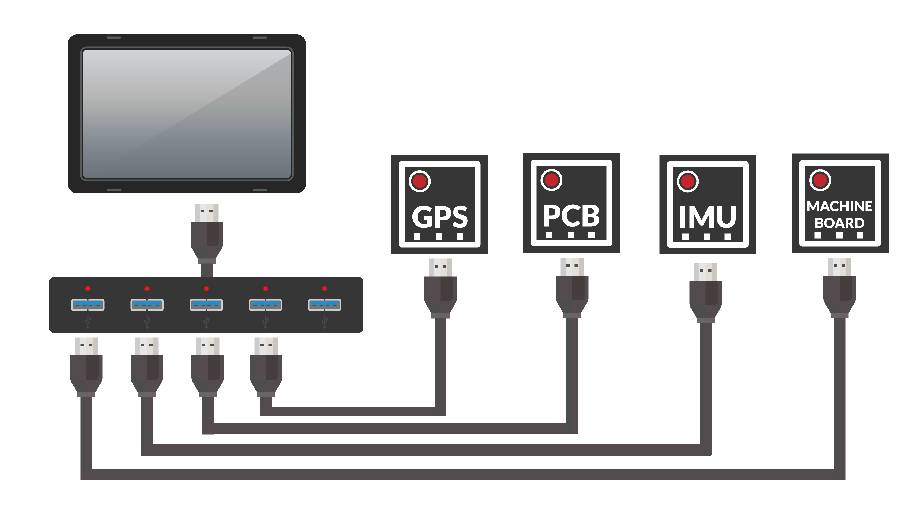

### UDP pros:
- Most reliable system

#### UDP cons:
- You need to configure the network
- Not all tablets have a LAN port, sometimes we have to use a USB-LAN adapter

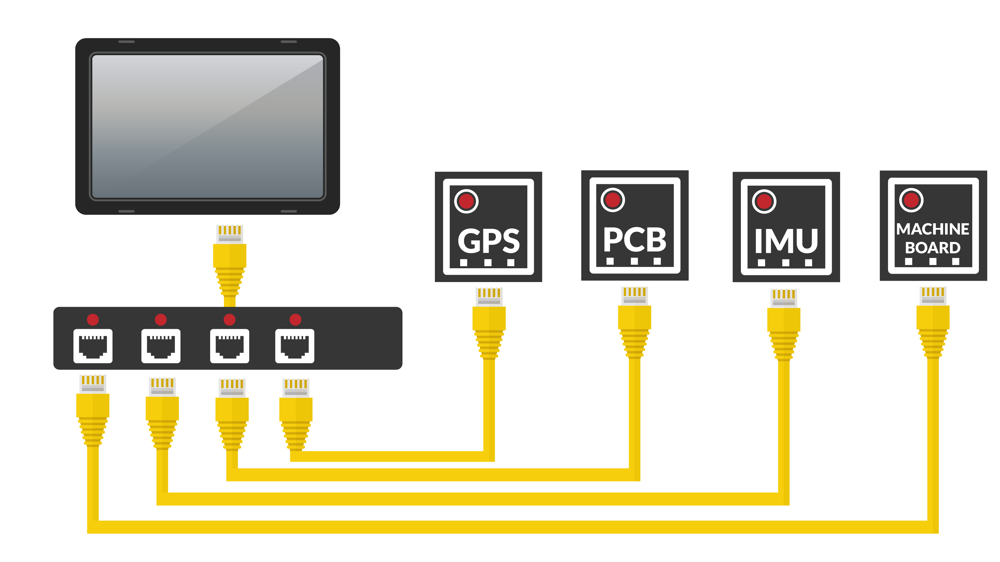

## 1.- Complete basic system with 12V motor

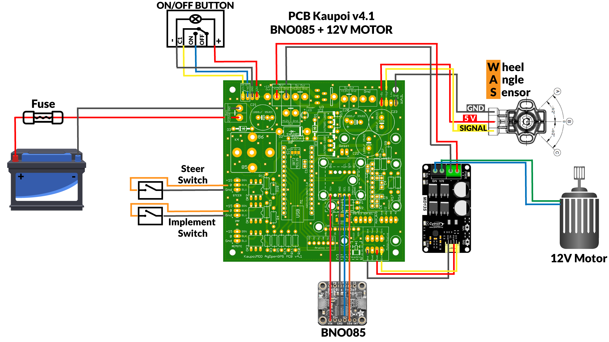

## 2.- Complete basic system with 24V motor

## 3.- BNO Chinese or Sparkfun (Remember these IMU need 3V)

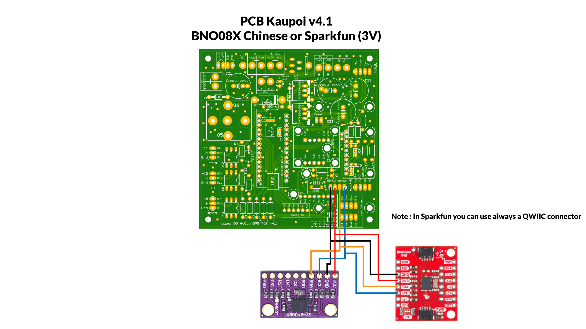

## 4.- Connect a BNO or CMPS to old PCB (like V2)
Remove BNO055 and MMA8452, use pins of MMA to connect BNO or CMPS (3.3V, SDA, SCL 
and GND)

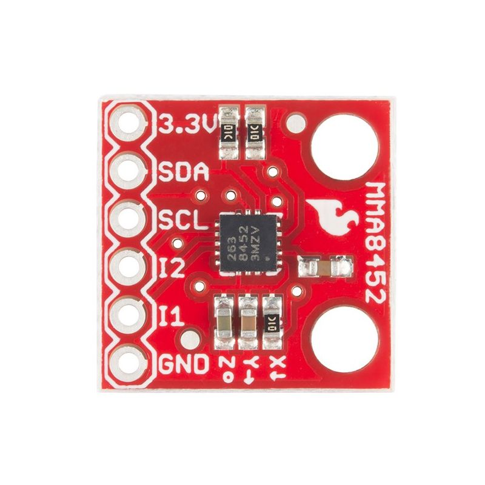

## 5.- IMU Module USB

BNO085 Adafruit
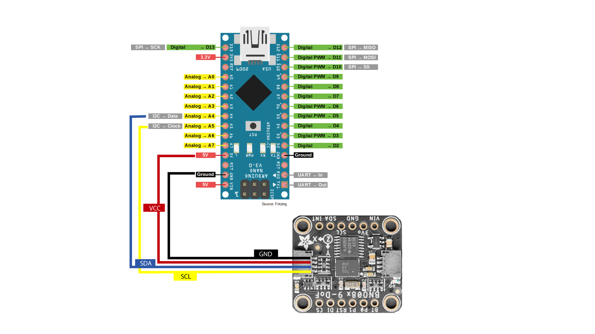
Remember if you use a Chinese or Sparkfun version connect VCC to 3.3V

CMPS14
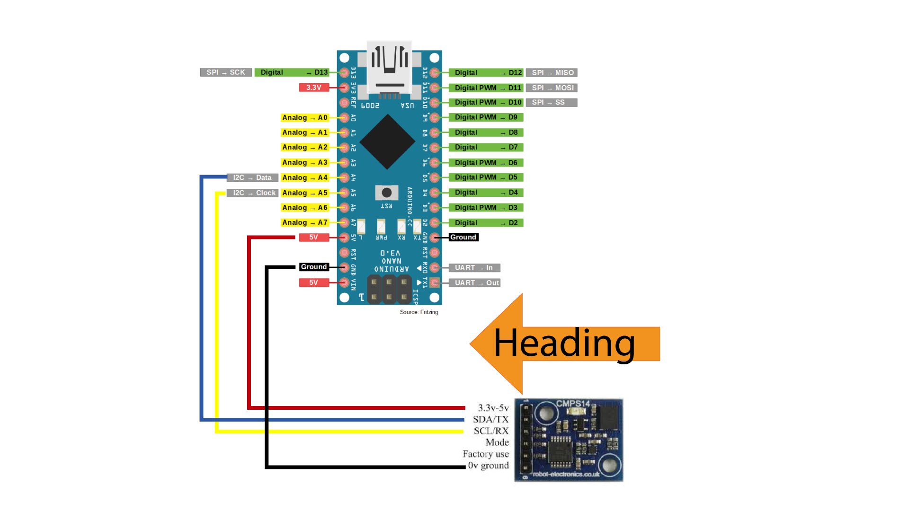

## 6.- IMU module UDP

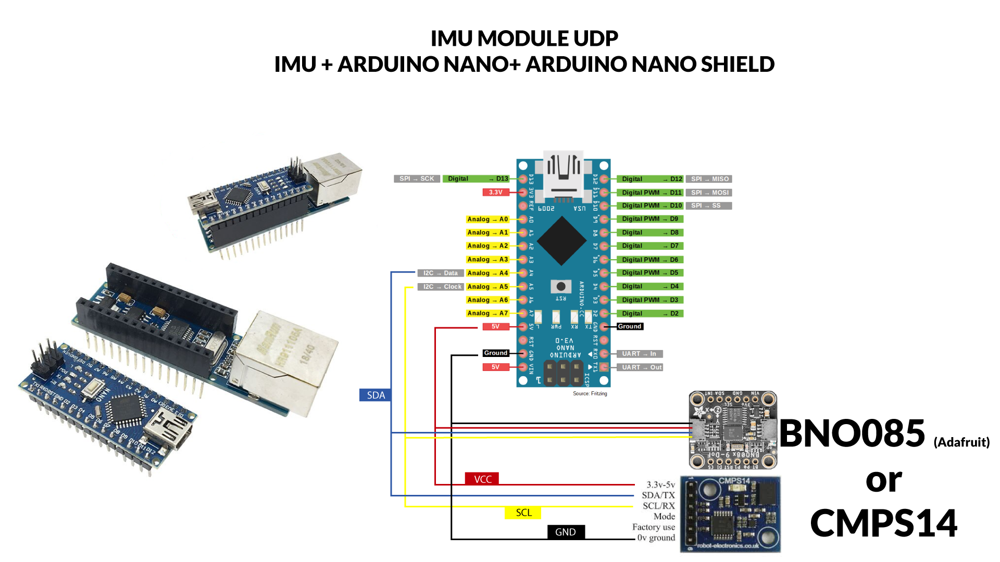

## 7.- IMU with IC2 extender PCA9615

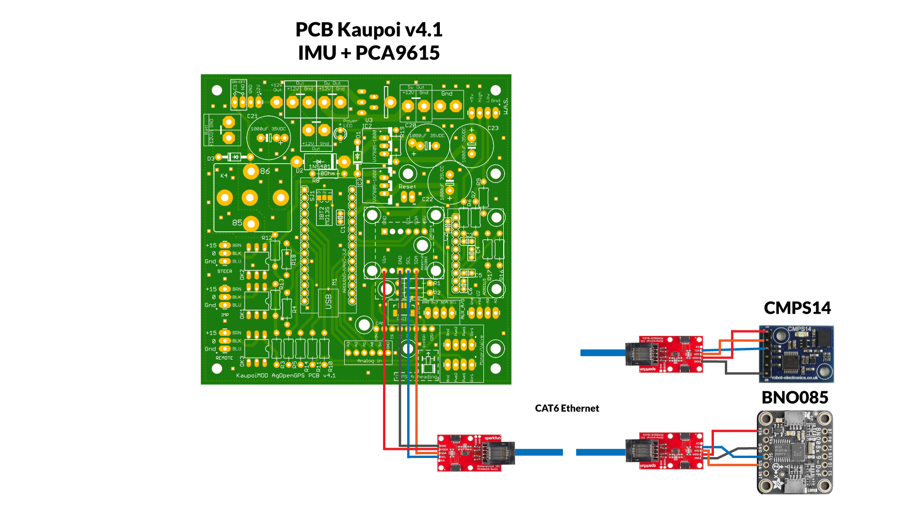
Remember if you use a Chinese or Sparkfun version connect VCC to 3.3V

## 8.- Motor wiring to prevent feed back Cytron
When we have the system on, even if the autosteering is not active, the Cytron sends power to the motor, making it difficult to manually actuate the steering. To avoid this problem there are two solutions:

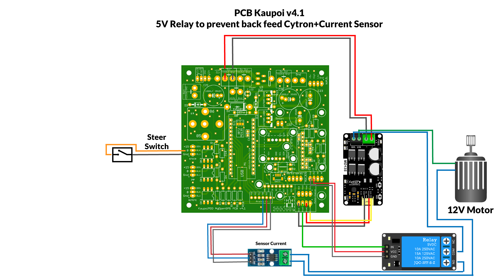

You can use a relay to break the circuit between the motor and Cytron, triggered by PWM2. That way there is no braking and no voltage coming back to the Cytron. A 5v Relay module is used, some users report that after a short time the relay stops working due to vibrations and the poor quality of the relay.

The second solution does not require additional wiring, just a bit of skill to carry out the modification.

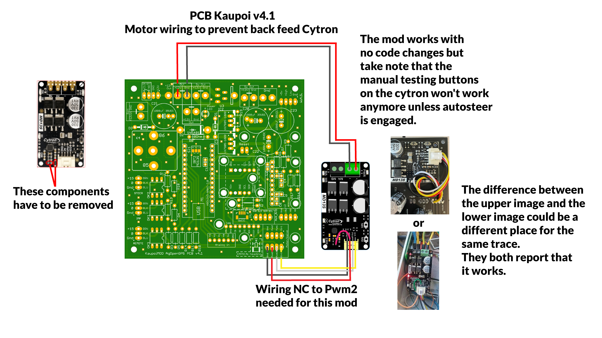

## 9.- Current sensor
Another extra for the system, it uses a hall sensor (ACS712 20A or 30A) to measure the amperage that the motor is receiving, and from AOG we can set a limit so that it disconnects the motor, so that when we take the steering wheel with our hand disconnect the autosteering.

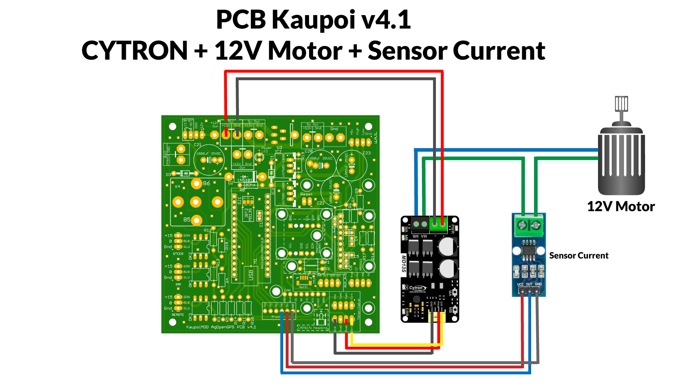

## 10.- Encoder
An encoder is a sensing device that provides a response, you can use this information to send a command for a particular function. They use different types of technologies to create a signal, including: mechanical, magnetic, optical, and resistance. For example, in optical sensing, the 
encoder provides information based on the interruption of light. We can use an encoder to disable autosteering.

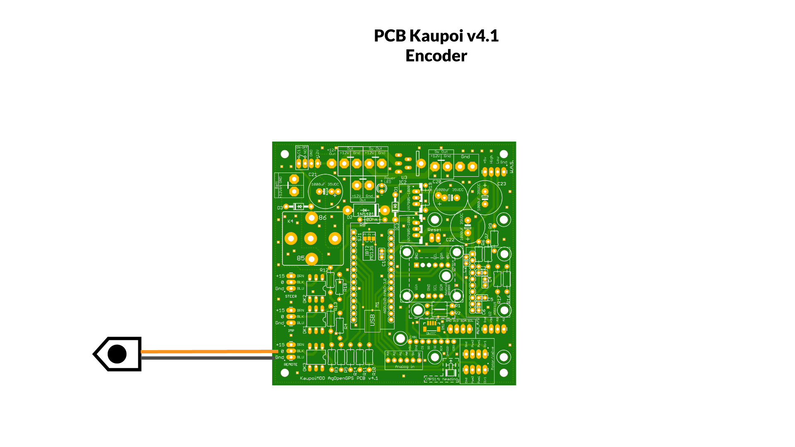

## 11.- Electrohydraulic valves

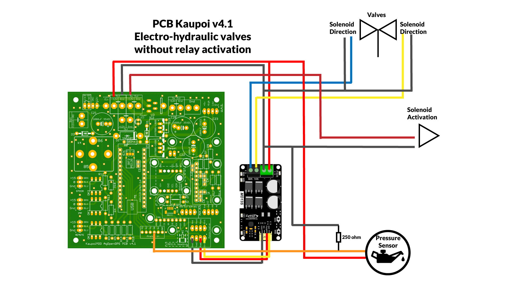

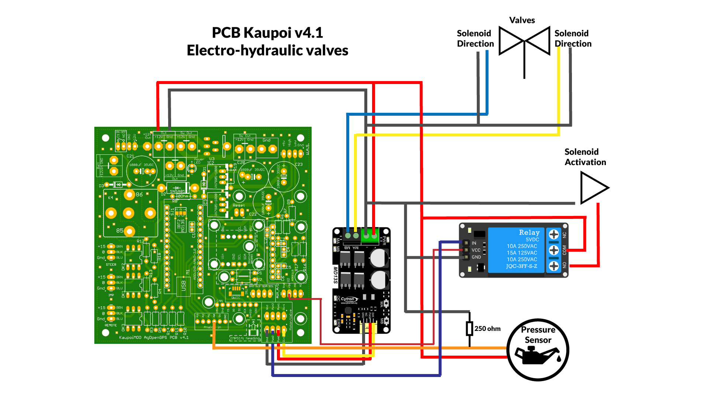

## 12.- Danfoss PVE valves

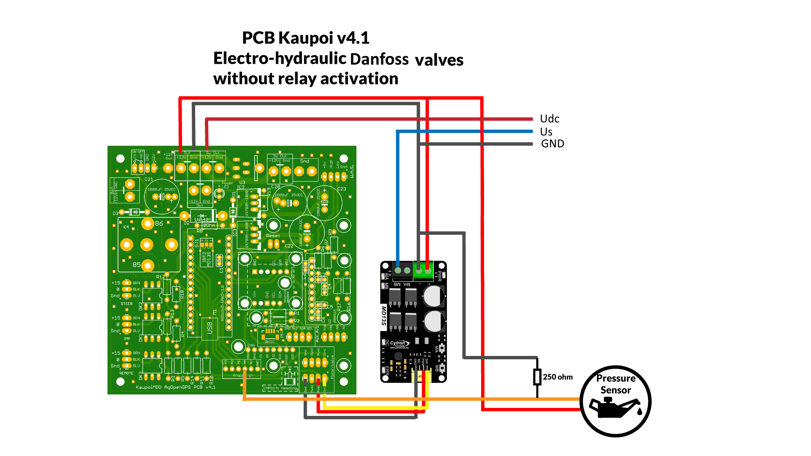