# AgOpenGPS Manual v5 (english)
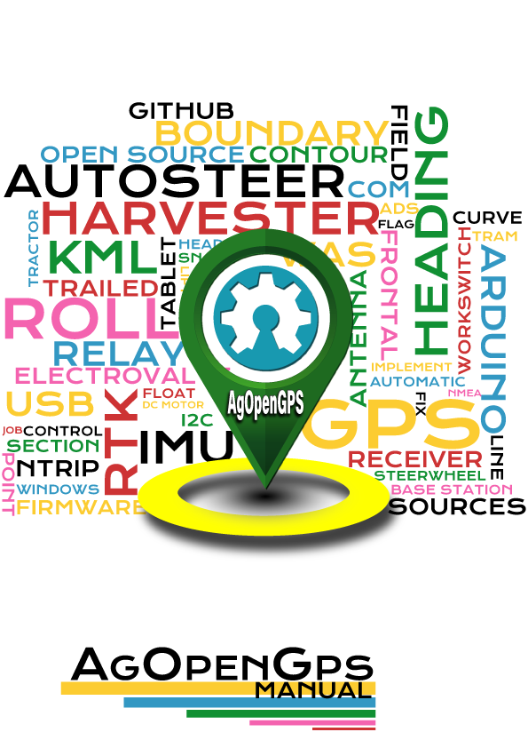

0. [AgOpenGPS](#aog)
1. [Main menu](#main-menu)
2. [Screen options](#screen-options)
3. [General Configuration](#general-config)
   1. [Vehicle Configuration](#vehicle-config)
      * [Vehicle General configuration](#vehicle-config-general)
      * [Vehicle dimensions](#vehicle-config-dimensions)
      * [Antenna configuration](#vehicle-config-antenna)
      * [Steer options](#vehicle-config-steer)
   2. [Implement Configuration](#implement-config)
      * [Attachment style](#implement-style)
      * [Attachment sections](#implement-sections)
      * [Attachment options](#implement-options)
      * [Switches / IO pins](#implement-switches)
   3. [Sources Configuration](#sources-config)
      * [Heading](#sources-heading)
      * [Single Antenna settings](#sources-antenna-single)
      * [Dual Antenna settings](#sources-antenna-dual)
      * [Roll](#sources-roll)
   4. [U-Turn](#uturn-config)
   5. [Machine / Implement Module](#machine-module)
      * [Implement Hydraulic Lift Config](#machine-hydraulics)
      * [Implement section Config](#machine-sections)
   6. [Tram line configuration](#tramline-config)
   7. [Icons configuration](#icons-config)
4. [Utilities](#utilities)
   1. [Wizards](#wizards)
      * [Steer Wizard](#wizards-steer)
   2. [Charts](#charts)
      * [Steer Chart](#charts-steer)
      * [Heading Chart](#charts-heading)
      * [XTE Chart](#charts-xte)
   3. [Smooth AB Curve](#smooth-ab)
   4. [Delete Contour Paths](#delete-contour)
   5. [Delete Applied Area](#delete-applied)
   6. [WebCam](#WebCam)
   7. [Offset Fix](#offset-fix)
   8. [Roll Easting](#roll-easting)
5. [Field Menu](#field-menu)
   1. [Field Menu with Open Field](#field-menu1)
   2. [Field Close](#field-close)
   3. [Boundaries](#boundaries)
   4. [Headland](#headland)
   5. [Tramlines](#tramlines)
   6. [Boundary Contours](#boundary-contours)
   7. [Recorded Path](#recorded-path)
6. [AgIO Shortcut](#agio)
   1. [AgIO Main Screen](#agio-main)
   2. [AgIO network configuration (UDP)](#agio-ethernet)
   3. [AgIO Components configuration](#agio-components)
   4. [AgIO Extra configuration](#agio-extra)
   5. [Ntrip](#agio-ntrip)
      * [NTRIP in same port of GPS](#agio-ntrip-gps)
      * [NTRIP using Radio Link](#agio-ntrip-radio)
      * [NTRIP using Serial Port](#agio-ntrip-serial)
7. [Steer Configuration](#steer-config)
   1. [Steer Tab](#steer-config-tab)
   2. [Power configuration](#steer-config-power)
   3. [Stanley](#steer-config-stanley)
   4. [Pure Pursuit (PP)](#steer-config-pursuit)
   5. [Drive and test](#steer-config-testdrive)
8. [Steer Mode](#steermode)
9. [Steer indicator](#steerindicator)
10. [AgOpenGPS Main Screen (Field Opened)](#aog-workscreen)
11. [AgOpenGPS Main Screen (Field Opened AB Line selected)](#aog-workscreen-ab)
12. [Flags](#aog-flags)
13. [Version/Paint color Mapping](#aog-version)
14. [AB Line](#ago-abline)
15. [AutoSteer](#aog-autosteer)
16. [U-Turn](#aog-uturn)
17. [Automatic sections](#aog-sections-auto)
18. [Manual sections](#aog-sections-manual)
19. [AB Line / AB Curve configuration](#aog-abline-config)
    1. [AB In Line](#aog-abline-config1)
    2. [AB Curve](#aog-abline-config2)
20. [Contour](#aog-contour)
21. [Snap to pivot](#aog-snaptopivot)
22. [AB Line Edit](#aog-abline-edit)
23. [U-Turn Skip](#aog-skip)
24. [Headland](#aog-headland)

## AgOpenGPS Main Screen (Startup) {#aog}
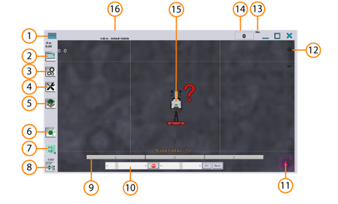

1. [Main menu](#main-menu)
2. [Screen options](#screen-options)
3. [General Configuration](#general-config)
4. [Utilities](#utilities)
6. [AgIO Shortcut](#agio)
7. [Steer Configuration](#steer-config)
8. [Steer Mode](#steermode)
9. Section Display
10. Simulator Control
11. [Steer indicator](#steerindicator)
12. Zoom Buttons
13. GPS Mode
14. Speedometer
15. Virtual button reset direction (restarts forward direction at push)
16. Field and Vehicle Information

###  Main Menu {#main-menu}
AgOpenGps general configuration.

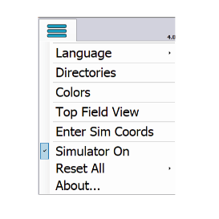
* **Language**: Available Translations for AgOpenGPS
* **Directories**: Folders used in AgOpenGPS 
* **Colors**: Color configuration. 
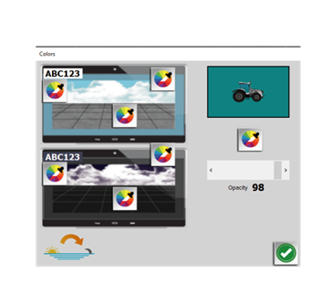

You can configure the colors for the day and night version, the color of the field, the letter and the windows.
Select the vision of the tractor or triangle, and color and intensity.
* **Top Field View**: Small window with the aerial view of the field.
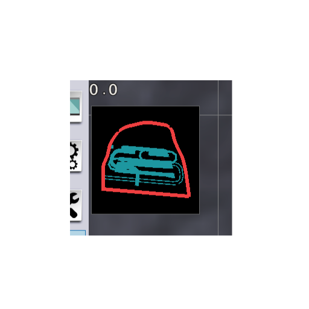
* **Enter Sim Coordinates**:  Possibility of modifying the simulation coordinates. Allows travel to imported fields.
* **Simlator On**: Toogle the simulator. Simulator is enabled by default when nothing is connected in AgIO.
* **Reset All**: Reset all configuration to default.
* **About**: Information about AgOpenGPS, Developer Team and License

### Screen Options {#screen-options}

|||
|------------------ | -------------- |
|  2D view  |  Pitch view up |
|  3D view  |  Pitch view down |
|  2D view North |  Zoom In |
| 3D view North |  Zoom Out |
|    Day / Night       | 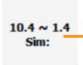 Performance Monitor for GPS / RTK |
|  Reduce brightness |  Increase brightness |

### General Configuration {#general-config}

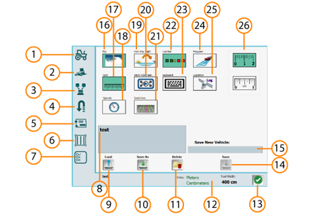

| SUBMENU | LOAD/SAVE | EXTRAMENU |
| ------- | --------- | --------- |
| 1 Vehicle configuration   | 8 Saved vehicles        | 16 Sky view in 3D          |
| 2 Implement configuration | 9 Load selected vehicle | 17 View grid in field      |
| 3 Sources configuration   | 10  Save actual vehicle as | 18 View speedometer     |
| 4 Uturn configuration     | 11  Delete selected vehicle | 19 Day/Night auto cycle|
| 5 Arduino configuration   | 12  Vehicle information | 20 Start full screen       |
| 6 Trams configuration     | 13  Done and exit       | 21 View extra guides       |
| 7 Icons configuration     | 14  Save vehicle        | 22 View lightbar           |
|                           | 15  Name new vehicle    | 23 Open keyboard           |
|                           |                         | 24 Polygons in mapping     |
|                           |                         | 25 Log NMEA                |
|                           |                         | 26 Units selection (cm/in) |

#### Vehicle configuration {#vehicle-config}

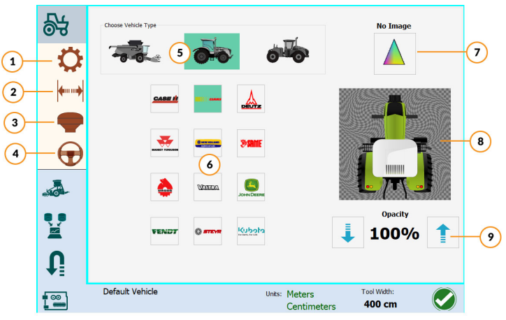
1. Vehicle type
2. Vehicle dimensions
3. Antenna configuration
4. Steering options

#####  Vehicle General configuration {#vehicle-config-general}
5. Vehicle type
    1. Harvester (rear wheel steering)
    2. Standard Tractor
    3. Articulated tractor
6. Brand
7. Triangle image icon
8. Preview box
9. Opacity

#####  Vehicle dimensions {#vehicle-config-dimensions}

**Wheel Base** Horizontal distance between the centres of the front and rear axles in cm/in

**Track Width** Distance measured across an axle from the centre line of one tyre tread to the centre line of the opposite tyre tread in cm/in

**Radius** Minimum turn radios in cm/in

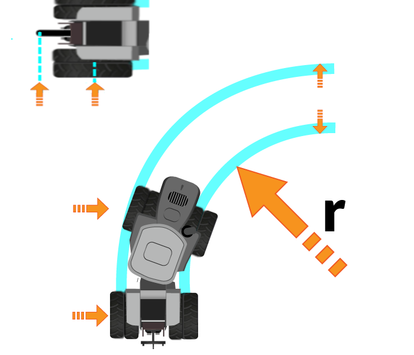
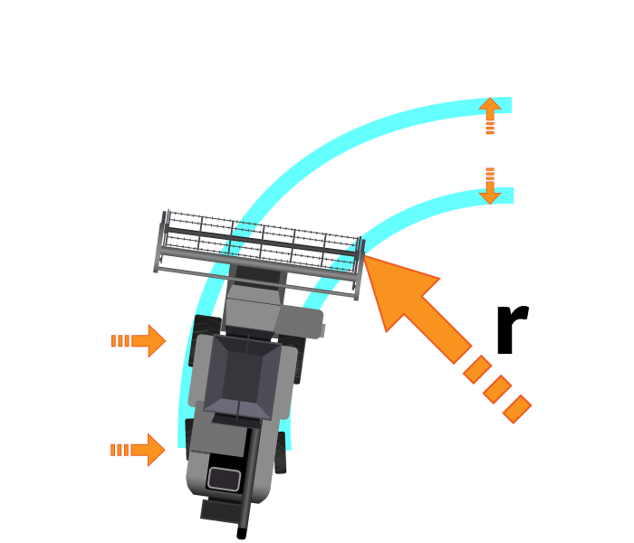

#####  Antenna configuration {#vehicle-config-antenna}

**Antenna distance** Antenna distance to axle (pivot point) in cm/in

**Antenna height** Distance between antenna and ground in cm/in

**Offset antenna** Distance between the antenna and the central axis of the vehicle, positive to the right, negative to the left in cm/in

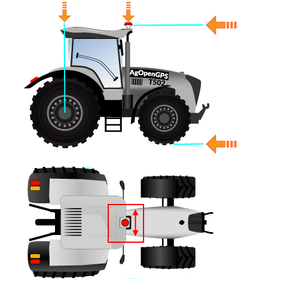
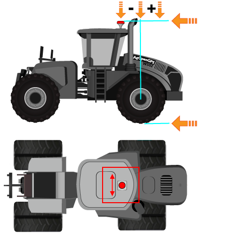
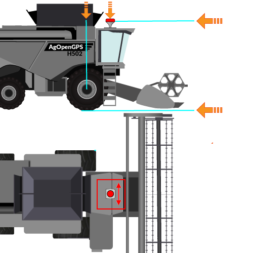

#####  Steer options {#vehicle-config-steer}

||||
|---|---|---|
|     | Lightbar       | Distance in cm/in for each frame |
|       | AB Line Length | In meters distance A to B |
|  | Lines width | In pixels |
|  | Nudge / Snap Distance | Default distance to snap |
|              | Constant contour recording | Button to let the software button follow the steer switch/button status |
| 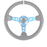      | Steer switch control | Manual / Remote |
|  | Line Acquire Lookahead | Time in sec !FIXME |

####   Implement configuration {#implement-config}

#####  Attachment style {#implement-style}

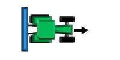
###### Rear fix
Attached to the rear 3 point linkage
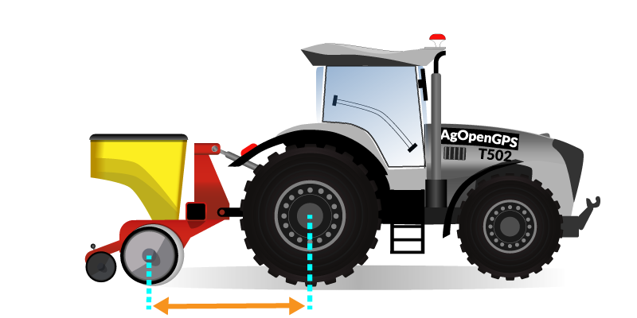
Distance between axle and implement center

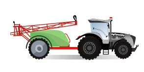
###### Trailed
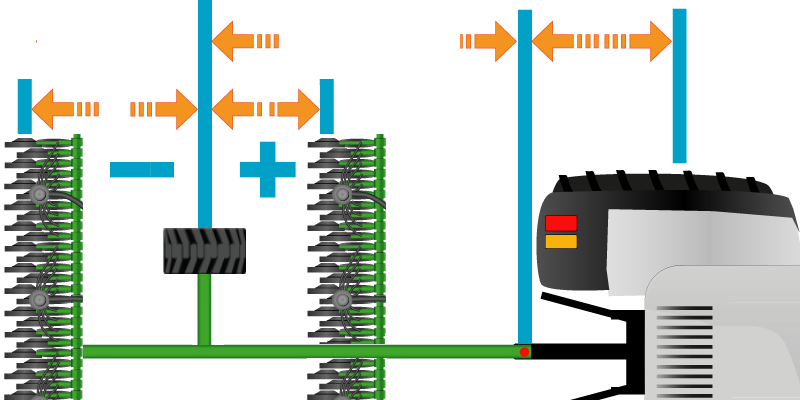
Distance between implement axle and pivot point
Distance between pivot point and tractor axle

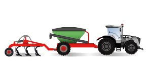      
###### Double trailed
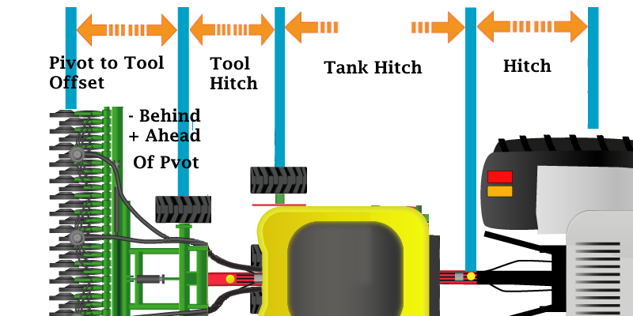
Distance between reare implement and middle implement
Distance between middle implement axle and pivot point !FIXME?
Distance between pivot point and tractor axle

###### Front
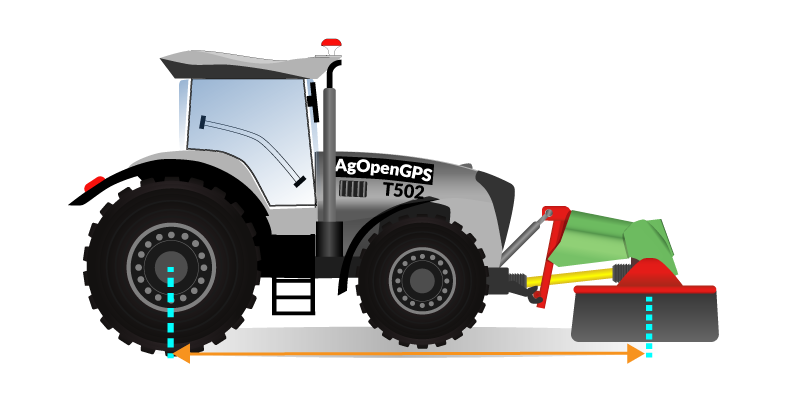
Distance between implement center and pivot axle

#####  Attachment sections {#implement-sections}
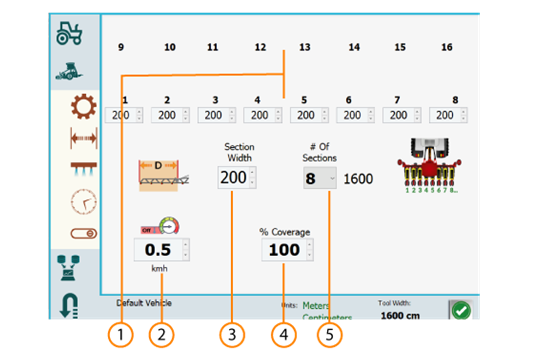

1. Length for each section in cm/in
2. 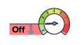 Speed below which sections are deactivated
3. Length of default section, if you change number of sections, all new sections have this length, in cm/in for each section
4. % Coverage all sections
5. Number of sections, and total length for attachment, in cm/in

 Assymetric attachment

 Symmetric attachment

#####  Attachment options {#implement-options}
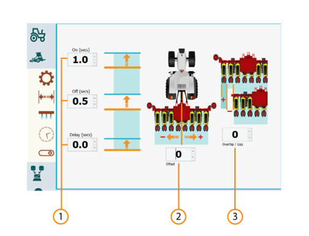

1. Time in seconds for activate disactivate, and delay
2. Offset attachment Distance between the central axis of attachment and the central axis of the vehicle, positive to the right, negative to the left in cm/in
3. Overlap/Gap Overlap distance in positive (cm/in) Gap distance in negative (cm/in)
 

#####  Switches / IO pins {#implement-switches}

||Work Switch||Steer Switch|
|---|---|---|---|
|| Enable work switch                 || Enable steer switch |
|                 | Work switch enable manual sections || Steer switch enable manual sections |
|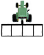          | Work switch enable auto sections   || Steer switch enable auto sections |

|Invert Switch behavior||
|---|---|
|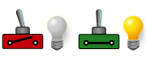        | Switch Active Closed |
|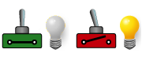          | Switch Active Open   |

###  Sources configuration {#sources-config}

####  Heading {#sources-heading}

|||
|---|---|---|
|       | Antenna Type   | Single: Fix or VTG  /  Dual   !FIXME What is VTG? |
|  | RTK alarm      | Screen message when RTK lost |
|                | Kill Autosteer | When RTK lost, program desactivate autosteer |

####  Single Antenna settings {#sources-antenna-single}

* **Fix tigger distance**: Distance in meters to start recognizing movement
* **Start speed**: Minimum speed to start recognizing movement
* **Reverse detection**: Enable reverse detection for program to detect reverse movement
* **Heading filter**: Fusion heading filter, more GPS or more IMU !FIXME What does this mean in practice?

####  Dual Antenna settings {#sources-antenna-dual}

* **Heading Offset**: Offset in degrees for dual heading. The slight variation between what the antennas say are 90 degrees but may be slightly off - like 89.6. So the offset would be 0.4
* **Dual as IMU**: Enable for using the heading from the dual antenna as an IMU. Will only work with FixToFix  !FIXME What is FixToFix?

####  Roll {#sources-roll}

|||
|---|---|
|| Remove offset |
| | Roll zero (tractor is at level ground) |
|    | Reset IMU: Reset IMU to default settings |
|  | Invert Roll Positive for tilt to the right, negative for tilt to the left |

Roll Filter: for PANDA messages set value in 0 or 1 ( !FIXME what does this do? What is PANDA?)

###  U-Turn menu {#uturn-config}

|||
|---|---|
|   | U-Turn Radius                                                               |
|   | Distance U-Turn legs ( Set extension length to 2 or 3 times the radius)     |
| | Distance to be kept from boundary                                           |
|   | Smoothing: How agressive the Turn start (Set it to 3 or 4 times the radius) |

###  Machine / Implement Module {#machine-module}

This only works when the dedicated machine module is present

####  Implement Hydraulic Lift Config {#machine-hydraulics}

|||
|---|---|
|| Enable/Disable |
| | Time in seconds that the raise of the hydraulic lift advances |
| | Time in seconds that the lowering of the hydraulic lift advances |
| | **Save Changes** _Mandatory for any change in this menu_ |
| | Invert Relays |

* **Hydraulic lift look ahead**: Time in seconds that the program looks forward to operate hydraulic lift |
* **User Pins**:  These are 4 user generated values that the machine module can use. They are just bytes sent

####  Implement section Config {#machine-sections}

Configure which Pin has which action. Each pin can have:
* Section 1 to 16
* **Hyd Up**: Raise Hydraulic Up
* **Hyd Down**: Lower Hydraulic Down
* **Tram Right**: Tram line right
* **Tram Left**: Tram line left
* **Geo Stop**: !FIXME Who am I?

 **Save Changes** _Mandatory for any change in this menu_ 

####  Tram line configuration {#tramline-config}

 Enable tram lines

 Distance between two tram lines in cm/in (FIXME! center to center?)

###  Icons configuration {#icons-config}

This menu allows to show/hide buttons, and the control of alerts.

#  Utilities {#utilities}

##  Wizards {#wizards}

### 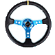 Steer Wizard {#wizards-steer}

Make sure you have:
* A big place to drive around in circles (required for WAS calibration)
* A straight line to configure WAS zero
* Able to tilt the tractor have a ditch or similar (required to roll calibration)
* Level surface (required for roll calibration)
* 

Steer setup wizard allows you to configure the vehicle specific parameters:
* Wheelbase axle distance in cm/in
* Track Width  distance in cm/in
* Antenna position Horizontally from pivot axle in cm/in
* Antenna height from ground in cm/in
* Antenna offset  positive value for right, negative value for left in cm/in
* External Steer switch and it's type: Push button , or toggle switch.
* A/D Convertor Connection (Single / Digital) !FIXME how do I know which one I have? Single is potentiometer, digital is CAN based?
* Motor Driver Cytron / ITBS2
* Driver Control Relay  
* Danfoss Valve is present?
* Roll Function
* Roll Calibration Reset
* WAS Direction (invert sensor)
* WAS Zeroing
* Steer Motor Direction
* WAS Calibration
* Guidance Steer Angle Limit
* Automatic Cancelling Feature ( Switch, overpower, overpressure)
* Panic Stop Speed !FIXME What does this do? Why 3? Min/Max?
* Minimum Movement Setting
* Gain Setting

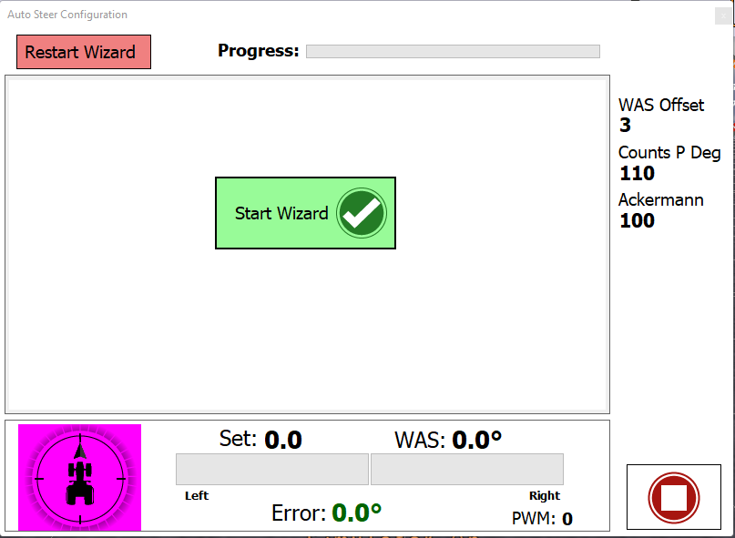

##  Charts {#charts}

### Steer Chart {#charts-steer}
Comparative graph of the real heading with the calculated one

### Heading Chart {#charts-heading}
Comparative graph of the fix2fix and IMU heading

### XTE (Cross Track Error) Chart {#charts-xte}
Graph that shows the XTE (cross track error), and compares the ideal line with the actual route

## 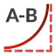 Smooth AB Curve {#smooth-ab}

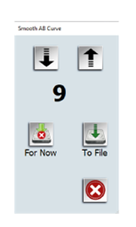

Activate AB Curve then use the arrows to modify AB Curve
Changes could be kept for this session or saved to file to be used later.

## 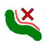 Delete Contour Paths {#delete-contour}
Delete all contours created

##  Delete Applied Area {#delete-applied}
Delete all sections and contours (cleans all painted areas)

##  WebCam (#WebCam)
Small window for webcam output signal

##  Offset Fix (#offset-fix)
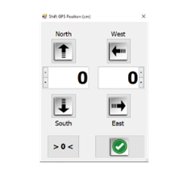

Shift GPS Position in cm/in

|||
|---|---|
|  | North |
|  | South |
| | East  |
|  | West  |
| [**>0<**] | Reset |

## Roll Easting {#roll-easting}
Chart !FIXME What do I do?

#  Field Menu (No open Field) {#field-menu}

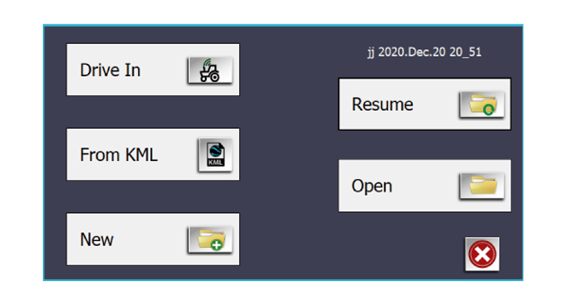

**Drive in** Drive to create new field

**From KML** Import KML file created with Google Earth

**New** Create a new field file, add name, date…

**Resume** Resume work in last field opened (last field displayed in top right corner)

**Open** Open field previously saved

##  Field Menu (With open Field) {#field-menu1}

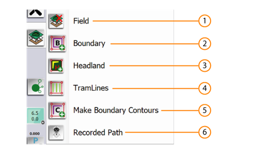

## 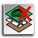 Field Close {#field-close}

Save or Close current field

##  Boundaries {#boundaries}

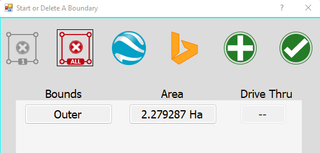
Create/Modfy boundaries. The GPS will respect these boundaries.
Boundaries could be the outer edge of the field but also ditches, trees and such.

Boundaries could be imported from Google Earth (KML file) or Bing as well.
New boundaries could be added via driving as well.

##  Headland {#headland}
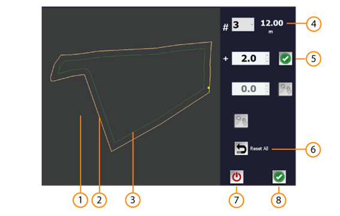

1. Field Map
2. Boundary
3. Headland
4. Number of passes: Headland distance calculated by the number of passes multiplied by the width of the implement
5. Extra Width: You can add extra width in metres
6. Reset all
7. Cancel
8. Done

When the headland is active new buttons appear at the bottom edge of the window, see [headland](#aog-headland)

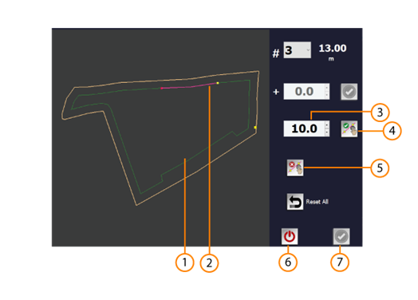

1. Modified Headland
2. Headland selected ready to modification Selection by touching two points in map
3. **Distance** in meters for modification, positive for inward direction, negative for outward direction
4. Validate modification
5. Cancel Modification
6. Cancel
7. Done

## 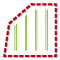 Tramlines {#tramlines}

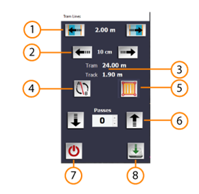

1. Arrows for modifying the starting line of the tram lines Distance in meters, half of attachment
2. Arrows for modifying the starting line of the tram lines Distance in cm 
3. Tram lines information Tram spacing configurated in General configuration of [Tram lines](#tramline-config) Track configurated in [Vehicle General configuration](#vehicle-config-general)
4. Change direction the starting line
5. Type of tram lines
   * Only tram lines 
   * All tram lines with headland
   * Only headland tram lines
   * Cancel tram lines
6. Number of passes
7. Turn Off Tramlines
8. Done

##  Boundary Contours {#boundary-contours}

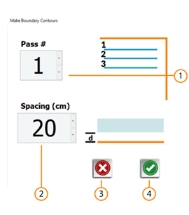
1. Number of passes
2. Spacing Distance in cm between boundary and first passe
3. Cancel
4. Done

##  Recorded Path {#recorded-path}

 Play 

Style:
   * 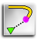 Resume at Beginning
   * 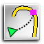 Resume at last stopped position
   * 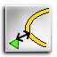 Resume at closest point

REC / Stop Once pressed, it changes to stop, to be able to stop recording
   *  Start Path recording
   *  Press to stop the recoring

 Open previously recorded Path

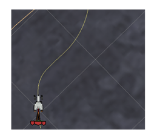

This function allows you to register any route to execute it

#  AgIO {#agio}
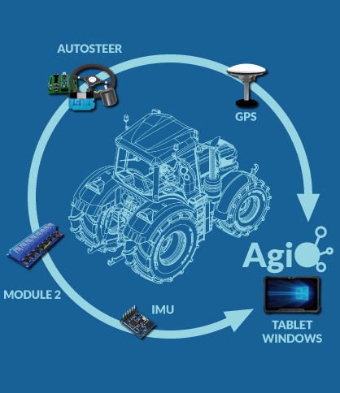

Program that controls communications between AgOpenGPS and all components:
* Tablet with AgOpenGPS
* GPS
* AutoSteer (PCB, DC Motor, Hydraulic valves)
* Machine modules
* IMU module

## AgIO Main Screen {#agio-main}

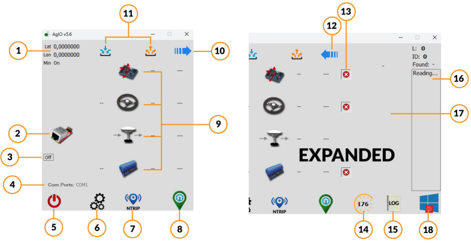

1. Coordinates information
2. UDP icon It is also a virtual button that opens a window that opens a window for UDP configuration, when UDP it’s active the icon turns green
3. UDP network Shows network status, OFF or IP of active network
4. Ports information Active COM ports
5. Turn Off
6. Extra configuration
7. NTRIP configuration
8. AgOpenGPS icon Shows AgOpenGPS or start it if it’s closed
9. Component icons It is also a virtual button that opens a window for the configuration and connection of the components
10. Expand arrow Expands window to show more information
11. In/Out information for each component It is also a virtual button that opens a window with information on GPS, speed, height, satellites, ...
12. Close Arrow Close expanded window
13. Hide/Show component
14. Timer Countdown to hide expanded window
15. Log Creates a log file named zAgIO_log.txt with all NMEA messages on program folder
16. NTRIP info box Shows info about NTRIP, type of NMEA messages, length and number of each message
17. Extra UDP info Only available if you are using UDP, show info about relays, CDP, WAS,…
18. Shutdown Button to shutdown Windows

## 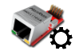 AgIO network configuration (UDP) {#agio-ethernet}
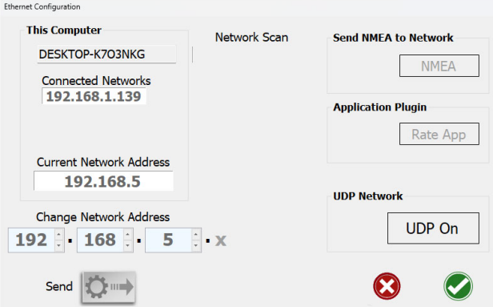

Press the UDP On button and Send to enable UDP, accepting configuration restarts AgIO
Standard sketches use 192.168.1 network address

Press the **UDP On** button to enable UDP

Standard routers usually use 192.168.(0-1-2).x

## AgIO Components configuration {#agio-components}

click on any of the components (GPS, Wheel, IMU) to open this screen

1. GPS Port
2. Bit Rate connection
3. Connect
4. Disconnect
5. RTCM Port If you use a different port for RTCM messages
6. GPS Information Box shows information about GPS messages (NMEA string)
7. IMU Module Port If you connect IMU directly to PCB don’t have port for IMU
8. Steer Port
9. Machine Module Port
10. Scan Ports
11. Done

##  AgIO Extra configuration {#agio-extra}

1.  Save AgIO config
2.  Load AgIO config
3.  Shows GPS information, same as [Steer indicator](#steerindicator)
4.  Opens Windows Device Manager

##  Ntrip {#agio-ntrip}

###  NTRIP in same port of GPS {#agio-ntrip-gps}

#### NTRIP Client (Source tab)

1. Source Tab
2. Position Tab
3. Advanced Tab
4. Host
5. IP address
6. Broadcaster Enter Caster URL or IP
7. Confirm IP
8. Caster IP When confirmed shows IP
9. Username Enter your Username for caster, (o) shows password
10. Password Enter your password for caster, (o) shows password
11. Get source table Shows all mounts available from your caster
12. Mount Shows selected mount
13. Caster port
14. NTRIP On Turns on/off NTRIP
15. Cancel
16. Done

#### NTRIP Client (Position tab)

1. Latitude for manual fix
2. Longitude for manual fix
3. Select fix type 
    * Use GPS Fix 
    * Use Manual Fix
4. Latitude current GPS fix
5. Longitude current GPS fix
6. Send GPS fix to Manual fix
7. Serial Send to GPS using Serial (USB. RS232)
8. UDP Send to GPS using UDP
9. UDP Port Port number for UDP
10. GGA interval Some providers like VRS Systems (Maschinenring, Sapos…) need your position, without your position they are not able to send you data. Here you can set the time how often you send back your position in seconds, 0 for turn off
11. NTRIP On Turns NTRIP ON/OFF
12. Cancel
13. Done

#### NTRIP Client (Advanced tab)

* HTTP Protocol
* Only TCP Port
* UDP Packets Default 256

###  NTRIP using Radio Link {#agio-ntrip-radio}

1. Port
2. Baudrate
3. Connect
4. Disconnect
5. Channels Channel identification and information
6. Command Line
7. Response Shows response of radio channel
8. Send Sends the frequency to the radio modem
9. Add Channel
10. Edit Channel
11. Erase Channel Turns NTRIP ON/OFF
12. Scan Ports
13. Enable Radio
14. Cancel
15. Done

###  NTRIP using Serial Port {#agio-ntrip-serial}

1. ScanPorts
2. Port
3. Baudrate
4. Connect
5. Disconnect
6. Serial Mode USB or RS232
7. UDP Mode Shows response of radio channel
8. Port UDP Default 2233
9. Serial Pass ON Enable Serial RTCM
10. Cancel
11. Done

#  Steer Configuration {#steer-config}

Consider using the Steering wizard for the initial setup!

##  Steer Tab {#steer-config-tab}

|||
|---|---|---|
|1 | Steer Tab          |                                               |
|2 | Power Tab          |                                               |
|3 | Stanley Tab        |                                               |
|4 | Pure Pursuit       | Tab Also known as PP                          |
|5 | WAS Angle indicator| WAS: Wheel Angle Sensor                       |
|6 | WAS Zero           | Allows the steering angle to be zero degrees when driving forward. This setting must be done and be zero degrees when driving straight ahead in order to be properly set. Wheel Angle Sensor (WAS) zero allows you to remove that non-zero steering angle so it is zero degrees. This is a very important setting and must be accurately set. |
|7 | WAS Zero slider    | For manual calibration, or tweak calibration  |
|8 | Counts per Degree  | Also known as CPD The A/D converter puts out -4000 to +4000 (8000 in total) levels as the Wheel Angle Sensor puts out 0 to 5v. To convert that into steer angle degrees - because we don’t visualize counts very well, we now divide those levels by counts per degree. So, when the CPD is increased, the wheels turn farther for each degree needed. When lowered, the wheels don’t turn as far.|
|9 | Ackermann          | Ackermann steering geometry is a geometric arrangement of linkages in the steering of a vehicle designed to solve the problem of wheels on the inside and outside of a turn needing to trace out circles of different radius.|
|10| Maximum steer angle| Lower this so the wheel stops before hitting the endstops |
|11| Steer angle setpoint| Steer angle requested by AgOpenGPS           |
|12| Actual steer angle | Read by WAS                                   |
|13| Error Angle        | Error between setpoint angle and actual angle |
|14| Expand Steer Config| Virtual Button (double push) shows Drive function in Steer configuration|

 
##  Power configuration {#steer-config-power}

|||
|---|---|---|
|1 | Proportional gain | The proportional gain are multiplied by the error then added to the minimum PWM value to generate the final output value. The higher this value the faster the motor will correct the steering. However, if it is too high, the steering will overshoot the line and then oversteer the other way again. Too low of a value and it will either take too long or never get to the guidance line |
|2 | Maximum PWN power | The maximum PWM value to generate the final output value                                               |
|3 | Minimum PWN power | Minimum PWM value is used to apply a minimum amount of power to overcome friction of the valve/motor   |

##  Stanley {#steer-config-stanley}

Stanley method use the front axle as its reference point. Meanwhile, it looks at both the heading error and cross-track error. 
In this method, the cross-track error is defined as the distance between the closest point on the path with the front axle of the vehicle.

|||
|---|---|---|
|1 | Aggressiveness      | The aggressiveness works with distance. The more aggressive the faster it tries to steer towards the line with the risk of crossing over the line |
|2 | Overshoot reduction | The overshoot affects how much opposition to aggressiveness there is by keeping the vehicle turning away from the line. It’s the winner of the two, heading and distance away that determines the length of time to get to the line. Ideal is to balance them so you get quickly to the line without going too far over the line or oscillating back and forth (too aggressive). |
|3 | Integral            | Uses 2nd order derivatives (non-linear steering methods) to bring the vehicle back to the line. As in, as they approach the line it needs to start steering away from the line to prevent crossing back and forth over the line and never getting on course, like an icy road. the opposite is taking way too long to get back on the line.|

##  Pure Pursuit (PP) {#steer-config-pursuit}

Pure Pursuit mode uses a look-ahead point which is a fixed distance on the reference path ahead of the vehicle as follows. The vehicle needs to proceed to that point using a steering angle which we need to compute. In this method, the centre of the rear axle is used as the reference point on the vehicle.

|||
|---|---|---|
|1 | Look Ahead             | Distance in meters how far is reference point             |
|2 | Look Ahead Speed Gain  | How far the look ahead goes ahead based on speed          |
|3 | Sidehill degrees       | Sidehill compensation in degrees for each degree in roll  |
|4 | Integral               | Uses 2nd order derivatives (non-linear steering methods) to bring the vehicle back to the line. As in, as they approach the line it needs to start steering away from the line to prevent crossing back and forth over the line and never getting on course, like an icy road. the opposite is taking way too long to get back on the line. |

## Drive and test {#steer-config-testdrive}

Double tap on the lower (bottom) edge to display the drive and test functions.

|||
|---|---|---|
|1 | Drive              | Connect the autosteer even if we don't have a line, drive straight. We can change the angle with the arrows. |
|2 | Snap Left/Right    | Increases by one degree in the selected direction |
|3 | Zero               | Set angle to zero, or if the is zero to +5 |
|4 | PWN                | Shows PWM used to run motor/valves |
|5 | REC                | Function to calculate the real steering angle, drive steady and show the angle when finished.|
|6 | Diameter           | Shows calculated diameter for REC function |
|7 | Steer Angle        | Shows Steer angle Shows that is used to calculate the diameter, is very important to keep it steady |
|8 | Expand Steer Config| Virtual Button (double push) shows all options in Steer configuration |

With all these functions they help us to correctly configure the parameters of the Steertab (7.1), WAS Zero, CPD, Akerman and Maximum Steer angle

|||
|---|---|---|
|1  | Danfoss           | Activate special configuration for Danfoss                |
|2  | Invert WAS        | Turn right positive value/ Turn left negative value       |
|3  | Turn Sensor       | When activated, box appears for counts selection          |
|4  | Invert Motor      |                                                           |
|5  | Pressure Turn Sensor | When activated, slider appears for pressure selection  |
|6  | Invert relays     |                                                           |
|7  | Current Turn Sensor When activated, slider appears for amps selection         |
|8  | Panic Stop Speed  | Stop autosteer at value, in Km/h                          |
|9  | Selection Motor driver | Cytron or IBT2                                       |
|10 | A2D Convertor     | Single or differential modes                              |
|11 | Steer enable      | None, switch or button                                    |
|12 | Reset             | Reset to default values                                   |
|11 | Send and save     | **Mandatory for any change in this menu**                 |

# Steer mode {#steermode}

 

By pressing the button, you can change the steering mode, the active mode is the one shown, P for Pure Pursuit and S for Stanley.
The small numbers above the icon are the integral correction calculations

#  Steer indicator {#steerindicator}

The direction indicator gives you information about the direction module. It also rotates like the wheels of the vehicle do.
There are four colors to know the status of the autosteer.

|||
|---|---|---|
|  | Purple   | No steer module connected                             |
|     | Red      | Steer module connected, not enabled                   |
|  | Orange   | Steer Module connected and enabled; steer switch off  |
|   | Green    | All connected and enabled                             |

# AgOpenGPS Main Screen (Field Opened) {#aog-workscreen}
Screen once a field is opened

17. Flags
18. Version/Paint color Mapping
19. AB line
20. Autosteer
21. Uturn
22. Automatic sections
23. Manual sections
24. Cycle AB line
25. AB line
26. AB curve
27. Contour

## AgOpenGPS Main Screen (Field Opened AB Line selected) {#aog-workscreen-ab}
Screen once an AB line is selected

Once an AB Line has been selected, new icons appear on the lower edge with new
functions, all of them can be hidden from the General configuration, Icons submenu (3.7)

28. Snap to pivot
29. AB Line Edit
30. Your Skip
31. Uturn skip

## Flags {#aog-flags}
AgOpenGPS allows you to flag anything you want to mark

1. Navigation arrows: Browse through the available flags.
2. Flags list
3. Flag information
4. Delete Flag
5. Done

##  Version/Paint color Mapping {#aog-version}

Icon that shows the current version, and is the button to open the color picker for mapping.

In AgOpenGPS you can choose any color for mapping

1. Day mode
2. Night mode
3. Lock/Unlock colors
4. Done
5. Preset colors

 
##  AB Line {#ago-abline}

1. Field Map
In the field map you can create all AB lines, existing ones are also
shown.
To create a new line, you only have to select two points on the
boundary (the points can be deleted with the icon 2 “Point
delete”). The line between the two points is created using the icon
7 “Curve” or the icon 11 “Line”.
2. Delete Point
3. Attachment width information
4. Distance to boundary By default, is half the width of the attachment
5. AB Line Swap direction
6. Boundary curve Create a curve line following the boundary limit
7. Curve For manual calibration, or tweak calibration
8. Cycle Curve Lines
9. Delete selected curve
10. Curve information Heading direction and time.
11. Line
12. Cycle Lines
13. Delete selected line
14. Line Information Heading direction and time.
15. Mapping Shows in map paint sections.
16. Done

##  AutoSteer {#aog-autosteer}

This icon is a button to activate the autosteer module.

 Green means AutoSteer is on.

 Red means it is disconnected or deactivated.

The letter refers to the option in [Vehicle Steer options](#vehicle-config-steer), M for Manual and R for remote 

 Button to let the software button follow the steer switch / button status

##  U-Turn {#aog-uturn}

 Green means U-Turn functionality is enabled.

 Green means U-Turn functionality is disabled.

Uturn configuration in 3.4

## Automatic sections {#aog-sections-auto}

  Enabled / ON

 Disabled / OFF

This button allows control sections with machine module.
You can see sections on or off in section display

## Manual sections {#aog-sections-manual}

 Enabled / ON

 Disabled / OFF

This button allows you to control sections manually
You can see and operate individual sections (on or off) in section display: 

## AB Line / AB Curve configuration {#aog-abline-config}

1. Line list
2. Delete selected line
3. Cancel
4. Duplicate line
5. Edit Line
6. Change direction line
7. Add AB line
New window appears, point 9 and following
8. Done

###  AB In Line {#aog-abline-config1}

This new window allows you to make a new AB Line driving between two points (A to B)

9. A Point
10. B Point
11. Heading direction
12. Cancel
13. Done

###  AB Curve {#aog-abline-config2}

This new window allows you to make a new path driving between two points (A to B)

14. Status
15. A Point
16. B Point
17. REC/Pause
18. Cancel

## Contour {#aog-contour}

1. Lock/Unlock
Locks or unlocks the line tracking, forcing to follow the line once it is
locked, if it is in the locked position an intermittent message
appears on the screen

## Snap to pivot {#aog-snaptopivot}
 This button sets the line at the pivot point

## AB Line Edit {#aog-abline-edit}

1. Half Snap
2. Snap
3. Change direction line
4. Snap to pivot
5. Heading direction You can manually edit heading direction
6. Presets heading direction 0/90/180/270 Degrees
7. Cancel and return
8. Done but don’t save
9. Save and done

## U-Turn Skip {#aog-skip}

Automatic skips in uturn like picture in icon. When set to zero machine will turn next to itself.
When set to a number it skips that many passes, allowing for quicker turns.

  Enabled / ON

 Disabled / OFF

Drop-down list with skip options in U Turn (0 to 10)

## Headland {#aog-headland}

1. Headland ON/OFF
2. Lift Control ON/OFF
3. Arrow lift control UP/DOWN info